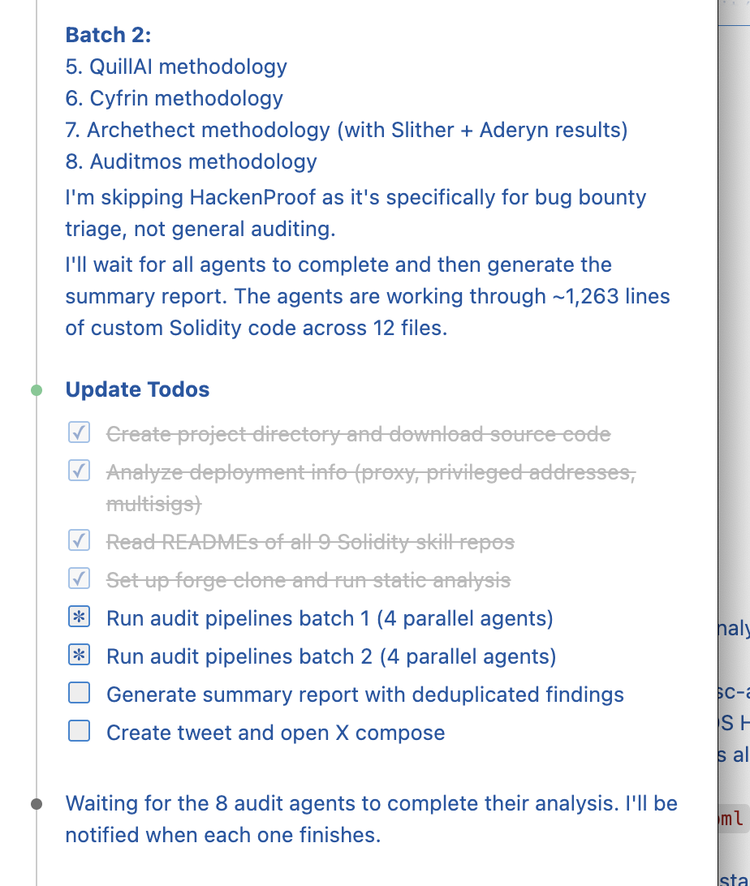
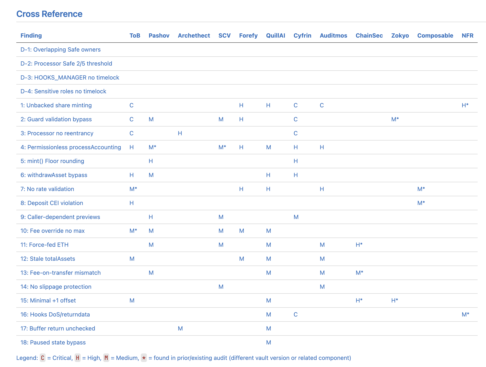

# OpenAudit

[](https://github.com/tradingstrategy-ai/openaudit/actions/workflows/ci.yml)

OpenAudit is a Claude Code/OpenAI Codex metaskill that runs smart contract source code through multiple agent-based auditing skill pipelines in parallel. By combining 100+ skills across 10+ community audit skill repositories, OpenAudit provides comprehensive and free smart contract security analysis using different methodologies, vulnerability databases, and static analysis tools.

The skill has been refined to a such a level that any software developer audit do a basic smart audit. You can point the skill to any deployed smart contract on any chain and get a basic audit report of its security qualities. No subscriptions or sign ups needed, 100% open source.


<!-- TOC -->

## Table of Contents

- [How it works](#how-it-works)
- [Supported agent pipelines](#supported-agent-pipelines)
- [Prerequisites](#prerequisites)
  - [Clone](#clone)
  - [macOS (Homebrew)](#macos-homebrew)
  - [Linux](#linux)
  - [Windows](#windows)
- [Usage](#usage)
- [Examples](#examples)
- [Configuration](#configuration)
- [Version history](#version-history)
- [Support](#support)
- [Social media](#social-media)

<!-- /TOC -->

[Read the announcement post](https://x.com/moo9000/status/2029511848525971928).

## How it works

1. We set up software tools for smart contract auditing and poking the chain
2. Point this skill to a smart contract address
3. It analyses deployment information (proxy patterns, privileged addresses, multisig setups)
4. Runs several audit skill pipelines against the project
5. Every audit pipeline products its own report, stored in `out` folder
6. Find existing audit reports and cross reference for the same contract
7. A summart report with deduplication and cross-reference is written at the end

The skills support Solidity, Vyper, Anchor (Rust) and CosmWasm (Rust) smart contracts.

The skill is in [skills/openaudit/SKILL.md](./skills/openaudit/SKILL.md).

## Supported agent pipelines

These are open source, community maintained, skill repositores which we are going to run against the smart contract we are going to audit:

| Repo                                                                     | Stars |          Skills |  Lines | Languages                                                                            | Contributors                                                                                                                                                                                                                                                                                                                                                                                                                                                                                                                                    | Twitter                                         |
| ------------------------------------------------------------------------ | ----: | --------------: | -----: | ------------------------------------------------------------------------------------ | ----------------------------------------------------------------------------------------------------------------------------------------------------------------------------------------------------------------------------------------------------------------------------------------------------------------------------------------------------------------------------------------------------------------------------------------------------------------------------------------------------------------------------------------------- | ----------------------------------------------- |
| [trailofbits/skills](./deps/trailofbits-skills)                          | 3,274 |              58 | 73,636 | Solidity, Cairo, Cosmos, Algorand, Substrate, Solana (Move), Go, Rust, Python, C/C++ | [dguido](https://github.com/dguido), [Ninja3047](https://github.com/Ninja3047), [GrosQuildu](https://github.com/GrosQuildu), [ahpaleus](https://github.com/ahpaleus), [dariushoule](https://github.com/dariushoule), [DarkaMaul](https://github.com/DarkaMaul), [hbrodin](https://github.com/hbrodin), [bsamuels453](https://github.com/bsamuels453), [mosajjal](https://github.com/mosajjal), [frabert](https://github.com/frabert), [sblackshear](https://github.com/sblackshear), [vanhauser-thc](https://github.com/vanhauser-thc) + 7 more | [@trailofbits](https://x.com/trailofbits)       |
| [pashov/skills](./deps/pashov-skills)                                    |   156 |               1 |  1,461 | Solidity                                                                             | [pashov](https://github.com/pashov), [Daneided](https://github.com/Daneided)                                                                                                                                                                                                                                                                                                                                                                                                                                                                    | [@pashov](https://x.com/pashov)                 |
| [Cyfrin/solskill](./deps/cyfrin-solskill)                                |    96 |               1 |    350 | Solidity                                                                             | [PatrickAlphaC](https://github.com/PatrickAlphaC)                                                                                                                                                                                                                                                                                                                                                                                                                                                                                               | [@PatrickAlphaC](https://x.com/PatrickAlphaC)   |
| [kadenzipfel/scv-scan](./deps/kadenzipfel-scv-scan)                      |    77 |               1 |  2,784 | Solidity                                                                             | [kadenzipfel](https://github.com/kadenzipfel)                                                                                                                                                                                                                                                                                                                                                                                                                                                                                                   | [@0xkaden](https://x.com/0xkaden)               |
| [forefy/.context](./deps/forefy-context)                                 |    70 |               3 | 15,371 | Solidity, Anchor (Solana), Vyper                                                     | [forefy](https://github.com/forefy)                                                                                                                                                                                                                                                                                                                                                                                                                                                                                                             | [@forefy](https://x.com/forefy)                 |
| [quillai-network/qs_skills](./deps/quillai-qs-skills)                    |    62 |              10 |  8,528 | Solidity                                                                             | [ChitranshVashney](https://github.com/ChitranshVashney), [michaeldim](https://github.com/michaeldim)                                                                                                                                                                                                                                                                                                                                                                                                                                            | [@QuillAudits_AI](https://x.com/QuillAudits_AI) |
| [Archethect/sc-auditor](./deps/archethect-sc-auditor)                    |    47 | 1 + 4 MCP tools |  1,285 | Solidity                                                                             | [Archethect](https://github.com/Archethect)                                                                                                                                                                                                                                                                                                                                                                                                                                                                                                     | [@archethect](https://x.com/archethect)         |
| [hackenproof-public/skills](./deps/hackenproof-skills)                   |     7 |               1 |    300 | Solidity, general web/mobile                                                         | [dorsky](https://github.com/dorsky)                                                                                                                                                                                                                                                                                                                                                                                                                                                                                                             | [@d0rsky](https://x.com/d0rsky)                 |
| [auditmos/skills](./deps/auditmos-skills)                                |     0 |              14 | 12,981 | Solidity                                                                             | [tkowalczyk](https://github.com/tkowalczyk)                                                                                                                                                                                                                                                                                                                                                                                                                                                                                                     | [@tomkowalczyk](https://x.com/tomkowalczyk)     |
| [Frankcastleauditor/safe-solana-builder](./deps/frankcastle-safe-solana) |    47 |               1 |  1,607 | Rust (Solana Anchor + Native)                                                        | [Frankcastleauditor](https://github.com/Frankcastleauditor), [Arrowana](https://github.com/Arrowana)                                                                                                                                                                                                                                                                                                                                                                                                                                            | [@0xcastle_chain](https://x.com/0xcastle_chain) |
| [The-Membrane/membrane-core](./deps/membrane-core)                       |    10 |               1 |  3,267 | CosmWasm (Rust)                                                                      | [triccs](https://github.com/triccs)                                                                                                                                                                                                                                                                                                                                                                                                                                                                                                             | —                                               |

## Prerequisites

The skills require access to the tooling, like Solidity compiler, Python-based [Slither](https://github.com/crytic/slither) or Rust-based [Foundry](https://www.getfoundry.sh/). We also use [web3-ethereum-defi](https://web3-ethereum-defi.tradingstrategy.ai/) and [Web3.py](https://web3py.readthedocs.io/en/stable/)
packages to read the chain data over RPCs.

### Clone

Clone the repository recursively to get the skills - currently packaged installation like PyPi is unsupported:

```shell
git clone --recursive --depth 1 https://github.com/tradingstrategy-ai/openaudit.git
```

### macOS (Homebrew)

Install and check dependencies:

```bash

# Python 3.11+
# Node 22+
brew install python uv brew codeql node rustup aderyn semgrep

# Rust toolchain (optional — needed for Aderyn static analyser)
rustup-init

# Foundry (forge — downloads verified contract source code)
curl -L https://foundry.paradigm.xyz | bash
foundryup

# Install Slither using Python uv packaging tool
uv sync

# Install a Solidity compiler Slither can use
SOLIDITY_VERSION=0.8.34 && uv run solc-select install $SOLIDITY_VERSION && uv run solc-select use $SOLIDITY_VERSION
```

Get a report everything is correctly installed:

```shell
scripts/check-prerequisites.sh
```

Then edit [env.sh](./env.sh.example) include necessary blockchain RPC API keys, Etherscan API keys and such.

```shell
cp env.sh.example env.sh
```

You need to add RPCs to chains where the contracts are deployed, and then any other API keys like Etherscan that may be needed to read the verified smart contract source code:

```shell
export JSON_RPC_ETHEREUM=
export ETHERSCAN_API_KEY=
```

The skill pipelines won't work without RPC API keys for the chains we are going to read, as we are auditing deployed contracts and their variable values. For reading the source code, we preper open [Sourcify](https://sourcify.dev/) over proprietary paid Etherscan, but due to history of proprietary tooling the source code may require Etherscan API key. Use [Chainlist](https://chainlist.org/) to get free RPC node APIs if needed.

### Linux

Tested on Arch Linux. Adapt the package manager commands for your distribution (e.g. `apt` on Debian/Ubuntu, `dnf` on Fedora).

#### Arch Linux

```bash
# Python 3.11+, Node 22+, and base dependencies
sudo pacman -S --needed python nodejs npm git base-devel

# uv (Python package manager)
curl -LsSf https://astral.sh/uv/install.sh | sh
source ~/.local/bin/env  # or restart your shell

# Rust toolchain (optional — needed for Aderyn static analyser)
sudo pacman -S --needed rustup
rustup default stable

# Foundry (forge — downloads verified contract source code)
curl -L https://foundry.paradigm.xyz | bash
foundryup

# Aderyn (optional — Solidity static analyser by Cyfrin)
cargo install aderyn

# Install Python packages (Slither, semgrep, web3, etc.)
uv sync

# Install a Solidity compiler Slither can use
SOLIDITY_VERSION=0.8.34 && uv run solc-select install $SOLIDITY_VERSION && uv run solc-select use $SOLIDITY_VERSION
```

#### Debian / Ubuntu

```bash
# Python 3.11+, Node 22+, and base dependencies
sudo apt update && sudo apt install -y python3 python3-venv nodejs npm git build-essential curl

# uv (Python package manager)
curl -LsSf https://astral.sh/uv/install.sh | sh
source ~/.local/bin/env

# Rust toolchain (optional — needed for Aderyn static analyser)
curl --proto '=https' --tlsv1.2 -sSf https://sh.rustup.rs | sh
source ~/.cargo/env

# Foundry (forge — downloads verified contract source code)
curl -L https://foundry.paradigm.xyz | bash
foundryup

# Aderyn (optional)
cargo install aderyn

# Install Python packages
uv sync

# Install a Solidity compiler Slither can use
SOLIDITY_VERSION=0.8.34 && uv run solc-select install $SOLIDITY_VERSION && uv run solc-select use $SOLIDITY_VERSION
```

### Windows

Unsupported.

## Usage

Open this repositorty in Claude Code/Codex/Visual Studio Code.

Use the skill by pointing it to a smart contract on a blockchain explorer:

```
/openaudit https://etherscan.io/address/0x657d9ABA1DBb59e53f9F3eCAA878447dCfC96dCb
```

Your AI will start to work on this:



When it is finished you get the summary and reports in writes them in [out](./out/) folder:



## Examples

See the [YieldNest OpenAudit report example](./docs/examples/openaudit-yieldnest-0x657d9a.md) and its [deployment findings](./docs/examples/addresses-yieldnest-0x657d9a.md) for weaknesses in controls.

## Configuration

The skill has been taught read multiple blockchains using Python and Web3.py.
[See here how the blockchains RPCs are configured](https://web3-ethereum-defi.tradingstrategy.ai/api/provider/_autosummary_provider/eth_defi.provider.env?highlight=env#). E.g. `JSON_RPC_ARBITRUM` for Arbirum RPCs.

Use [env.sh](./env.sh.example) to source the RPC API keys and such that the skills needs.

You can use [get-block-number](./skills/get-block-number/SKILL.md]) skill to test RPCs:

```
/get-block-number arbitrum
```

Should give you:

```
Chain: Arbitrum
Latest block number: 439,218,227
```

## Version history

- [Read changelog](https://github.com/tradingstrategy-ai/web3-ethereum-defi/blob/master/CHANGELOG.md).

## Support

- [Join Discord for any questions](https://tradingstrategy.ai/community).

## Social media

- [Follow on Twitter](https://twitter.com/TradingProtocol)
- [Follow on Telegram](https://t.me/trading_protocol)
- [Follow on LinkedIn](https://www.linkedin.com/company/trading-strategy/)
- [Follow on YouTube](https://www.youtube.com/@tradingstrategyprotocol)

# License

MIT.

[Created by Trading Strategy](https://tradingstrategy.ai).
